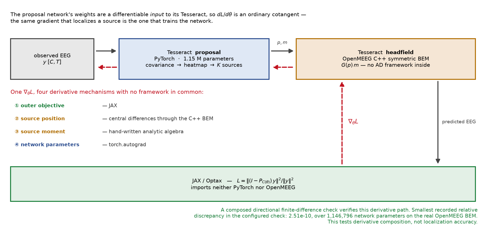

# NeuroLocate

**Differentiable EEG inference across PyTorch, OpenMEEG, and JAX.**


Two neural sources 15.2 mm apart, sharing one time course, seen through 64 scalp
electrodes. Both runs above descend the *same* objective through the *same* C++
boundary-element head model for the same 300 steps; the only difference is where
they start. The uninformed start converges with one source 124.3 mm from the
truth. Starting from a trained PyTorch network's guess, the same refinement ends
6.9 mm from the worse of the two. The two answers fit the measured EEG almost
equally well — sensor residual 0.0117 against 0.0120 — which is why the starting
point decides the outcome.

## Try it

```bash
git clone <this repository> && cd NeuroLocate-showcase
make setup        # uv venv + the app, both components, and dev deps
make demo         # ~1 minute, CPU, offline, no Docker
```

`make demo` takes one trial of the frozen benchmark and runs three estimators on
it. Expected output:

```
  worst-source localization error, this trial (bar full scale 60 mm)
  uninformed + refinement  ########################################  124.3 mm
  proposal only            ######..................................    8.7 mm
  proposal + refinement    #####...................................    6.9 mm
```

The trained network is packaged inside its component and the observation is a
committed artifact, so nothing is downloaded and nothing is trained. Docker is
not needed for the demo — only for `make build`, which packages each component
as a container image.

## What it does

Given a 64-channel EEG epoch, estimate where in the head the signal came from.

```
64-channel EEG epoch
        │
        ▼
trained PyTorch proposal      sensor covariance → K source positions
        │
        ▼
native C++ OpenMEEG forward   positions + moments → predicted EEG
        │
        ▼
JAX/Optax refinement          300 Adam steps down the sensor residual
        │
        ▼
K source positions in the head frame
```

**K** is the number of simultaneously active compact sources the estimator is
told to look for. There are about 20,000 candidate cortical locations and only 64
sensors, so the unrestricted problem has no unique answer; assuming a small,
known K is what makes a recovered position mean something. In this benchmark K is
given to every method, including every baseline, so no method is advantaged by
knowing it.

The proposal network is a trained model's output used as an informed
initialization. It is not a random start, it is not an exhaustive search, and it
is not guaranteed to recover the truth.

## Why Tesseract



| component | native stack | derivative |
| --- | --- | --- |
| `proposal` | PyTorch | `torch.autograd` |
| `headfield` | OpenMEEG / C++ | analytic moment VJP + finite-difference position VJP |
| outer loop | JAX / Optax | `jax.grad` |

Tesseract lets each component keep its own runtime and its own derivative
implementation while exposing the composed workflow to JAX. The head-physics
component contains no autodiff framework at all — its derivative contract is
written by hand, because OpenMEEG is a compiled C++ solver — and the network
component contains no solver. One `jax.grad` crosses both boundaries.

A composed directional finite-difference check verifies the packaged derivative
path; the smallest recorded relative discrepancy in the configured check is
2.51e-10. That tests derivative *composition*, and says nothing about
localization accuracy.

Not every operation in the proposal is differentiated. Which lattice voxels
become sources is a hard `argmax` with greedy non-maximum suppression: discrete,
and detached. What carries gradient is each selected voxel's continuous offset
and dipole direction, and everything downstream of them.

## Frozen K=2 benchmark

10 conditions, 80 trials, matrix fingerprint `35b6e07a7e130731`, committed before
the results were produced. Per-source recovery at K=2 — an estimate counted as
recovered when it lands within 20 mm of the source it was matched with:

| method | sources recovered | median s / trial |
| --- | --- | --- |
| uninformed initialization + refinement | 41.3% | 19.2 |
| RAP-MUSIC | 57.5% | 6.5 |
| four physical restarts | 71.3% | 69.0 |
| learned proposal alone | 80.0% | 0.0 |
| proposal + physical refinement | 82.5% | 16.8 |

Learned initialization accounts for most of the recovery gain: 41.3% → 80.0%
comes from where the search starts, and 80.0% → 82.5% from the physical
refinement that follows. Refinement shows up more clearly in continuous
localization error than in recovery rate. On the correlated and shared-dynamics
cells (56 trials), paired per trial, the composition is 4.1 mm closer than the
proposal alone, 6.7 mm closer than the uninformed initialization, and 16.7 mm
closer than RAP-MUSIC; all three intervals exclude zero.

Four independent restarts of the same physical refinement, keeping the best data
fit, reach comparable localization — and take about 69 s per trial against about
17 s for the composition. That is amortized inference time only; it does not
include the cost of training the network.

Regenerate the whole table from the committed shards with `make summary`.
[`docs/BENCHMARK.md`](docs/BENCHMARK.md) records what was measured and how.

## Scope

- K is given to every method in the benchmark, including every baseline.
- The headline result is K=2. At K=4 the current proposal does not help: RAP-MUSIC
  is 29.9 mm closer in the frozen K=4 comparison, and that is reported, not hidden.
- Observations are synthetic and deliberately generated with a mismatched forward
  model — MNE's linear-collocation BEM on ico4, at a skull conductivity the
  estimators do not assume, with the electrodes displaced. There is no matched
  cell.
- Template anatomy (fsaverage) throughout. It is not anyone's head.
- No clinical or medical-device claim is made or implied.

## Reproducibility

```bash
make demo          # the deterministic K=2 trial, ~1 min
make test          # the full in-process suite, ~3 min, no container runtime
make build         # build both Tesseract images (needs Docker)
make test-images   # run the packaged JSON test cases against the built images
```

Every number above comes from a committed synthetic artifact: the frozen shards
under `results/hybrid/shards`, the observation artifact `results/hybrid/`
`observations.npz`, and the packaged network checkpoint inside the `proposal`
component. Each component ships frozen input/output JSON cases that are executed
both in-process and against its built image, so a behaviour change fails in
either transport. [`docs/REPRODUCIBILITY.md`](docs/REPRODUCIBILITY.md) says which
file backs which number.

## Repository map

```
app/neurolayout/        the JAX orchestrator: objective, refinement, benchmark, baselines
  hybrid/               the learned proposal and its physical refinement
components/
  tesseracts/proposal/  PyTorch network + packaged checkpoint + frozen test cases
  tesseracts/headfield/ OpenMEEG forward + hand-written VJPs + frozen test cases
  shared_code/          NumPy-only geometry and the cached head model
scripts/                demo, benchmark runner, summary, figures
results/hybrid/         the frozen shards, the observation artifact, the summary
docs/                   BENCHMARK.md, REPRODUCIBILITY.md, figures
tests/                  component, gradient, composition and frozen-result gates
```

The Python packages are still called `neurolayout` and `neurolayout_shared`, from
an earlier phase of the project. The names were not churned; nothing depends on
them meaning anything.

## License

Apache-2.0 — see [LICENSE](LICENSE).

Third-party components, used under their own licenses: [OpenMEEG](https://openmeeg.github.io)
(CeCILL-B) for the boundary-element solver, [MNE-Python](https://mne.tools)
(BSD-3-Clause) for the offline generation of head models and observations, and
PyTorch, JAX and Optax. The packaged head-model and cortical-surface artifacts
are derived from the FreeSurfer `fsaverage` template distributed with MNE-Python.
