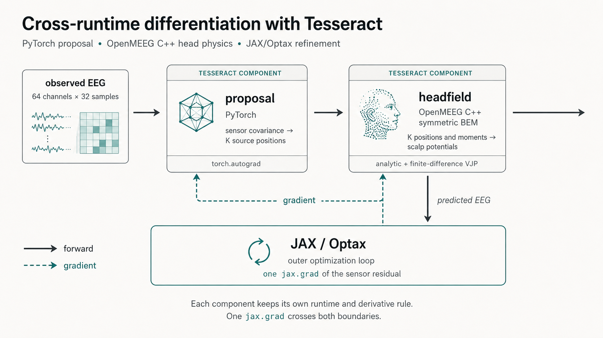
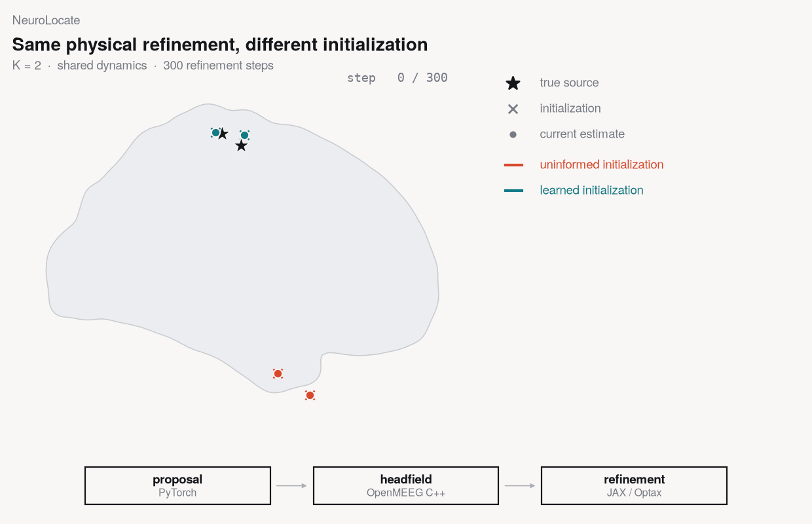
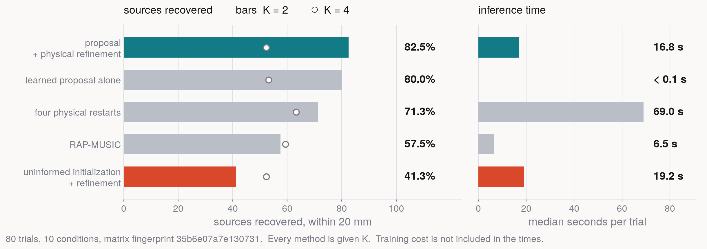

# NeuroLocate

**Differentiable EEG inference across PyTorch, OpenMEEG, and JAX.**

A trained PyTorch model proposes where the sources are. A native C++
boundary-element solver computes the physics. A JAX/Optax loop refines the
proposal by differentiating through both. Tesseract composes the three without
any of them sharing a runtime or an autodiff framework.



## Try it

```bash
git clone https://github.com/BrainCapture/NeuroLocate && cd NeuroLocate
make setup        # uv venv + the app, both components, dev deps
make demo         # ~1 minute, CPU, offline, no Docker
```

```
  worst-source localization error, this trial (bar full scale 60 mm)
  uninformed + refinement  ########################################  124.3 mm
  proposal only            ######..................................    8.7 mm
  proposal + refinement    #####...................................    6.9 mm
```

The trained network ships inside its component and the observation is a committed
artifact, so nothing is downloaded and nothing is trained. Docker is needed only
for `make build`, which packages each component as a container image.

## Why Tesseract

| component | native stack | derivative |
| --- | --- | --- |
| `proposal` | PyTorch | `torch.autograd` |
| `headfield` | OpenMEEG / C++ | analytic moment VJP + finite-difference position VJP |
| outer loop | JAX / Optax | `jax.grad` |

OpenMEEG is a compiled C++ solver with no autodiff of any kind, so the
`headfield` component's derivative contract is written by hand. The `proposal`
component carries PyTorch and has never heard of OpenMEEG. The orchestrator
imports neither. One `jax.grad` crosses both boundaries and comes back with a
cotangent on the network's weights.

A composed directional finite-difference check verifies that derivative path; the
smallest recorded relative discrepancy in the configured check is 2.51e-10. That
tests derivative composition, and says nothing about localization accuracy.

Not every operation in the proposal is differentiated. Which lattice voxels
become sources is a hard `argmax` with greedy non-maximum suppression: discrete,
and detached. Gradient flows through each selected voxel's continuous offset and
dipole direction, and everything downstream of them.

## What the loop shows



*Two sources 15.2 mm apart, sharing one time course, seen by 64 electrodes. Both
runs descend the same objective through the same OpenMEEG solver for the same 300
steps, shown at seven recorded checkpoints. Only the starting point differs.*

Given a 64-channel epoch, find the `K` compact sources that produced it. `K` is
the number of simultaneously active sources the estimator is told to look for.
There are about 20,000 candidate cortical locations and 64 sensors, so the
unrestricted problem has no unique answer; a small, known `K` is what makes a
recovered position mean anything. **Every method in this benchmark is given `K`.**

The two runs in the loop differ only in where they start. One begins from an
uninformed point and ends with a source 124.3 mm from the truth. The other begins
from the trained network's guess and ends 6.9 mm from the worse of the two. Their
sensor residuals are 0.0117 and 0.0120 — the anatomically poor answer fits the
measurement very slightly better. At `K = 2` on rank-one data, similar EEG fit
corresponds to very different source anatomy, so the data does not identify the
answer on its own and the starting point decides which one is returned.

The proposal is a trained model's output used as an informed initialization. It
is not a random start, not an exhaustive search, and not guaranteed to recover
the truth.

## Frozen benchmark



10 conditions, 80 trials, matrix fingerprint `35b6e07a7e130731`, committed before
the results were produced. A source counts as recovered when the estimate matched
to it lands within 20 mm.

Learned initialization accounts for most of the gain at `K = 2`: 41.3% → 80.0%
comes from where the search starts, 80.0% → 82.5% from the physical refinement
that follows. Refinement shows up more clearly in continuous error than in
recovery rate — on the 56 correlated and shared-dynamics trials, paired per
trial, the composition is 4.1 mm closer than the proposal alone, 6.7 mm closer
than the uninformed initialization, and 16.7 mm closer than RAP-MUSIC, all three
intervals excluding zero.

Four independent restarts of the same refinement reach comparable localization at
about 69 s per trial against about 17 s for the composition. That is amortized
inference time; it does not include the cost of training the network.

`make summary` regenerates every number above from the committed shards.
[`docs/BENCHMARK.md`](docs/BENCHMARK.md) records what was measured and how.

## Scope

- `K` is given to every method, including every baseline.
- The headline result is `K = 2`. At `K = 4` the current proposal does not help:
  RAP-MUSIC is 29.9 mm closer in the frozen K=4 comparison.
- Observations are synthetic and deliberately generated with a mismatched forward
  model — MNE's linear-collocation BEM on ico4, at a skull conductivity the
  estimators do not assume, with the electrodes displaced. There is no matched
  cell.
- Template anatomy (fsaverage) throughout. It is not anyone's head.
- No clinical or medical-device claim is made or implied.

## Reproducibility

```bash
make demo          # the deterministic K=2 trial, ~1 min
make test          # the full in-process suite, ~8 min, no container runtime
make build         # build both Tesseract images (needs Docker)
make test-images   # the packaged JSON cases against the built images
make figures       # the benchmark figure
make k2-visual     # the README loop, from the recorded trajectories
```

Every number here comes from a committed artifact: the frozen shards under
`results/hybrid/shards`, the observation set `results/hybrid/observations.npz`,
and the packaged checkpoint inside the `proposal` component. Each component ships
frozen input/output JSON cases executed both in-process and against its built
image. [`docs/REPRODUCIBILITY.md`](docs/REPRODUCIBILITY.md) says which file backs
which number.

## Repository map

```
app/neurolayout/        the JAX orchestrator: objective, refinement, benchmark, baselines
  hybrid/               the learned proposal and its physical refinement
components/
  tesseracts/proposal/  PyTorch network + packaged checkpoint + frozen test cases
  tesseracts/headfield/ OpenMEEG forward + hand-written VJPs + frozen test cases
  shared_code/          NumPy-only geometry and the cached head model
scripts/                demo, benchmark runner, summary, figures, README loop
results/hybrid/         the frozen shards, the observation set, the summary
docs/                   BENCHMARK.md, REPRODUCIBILITY.md, figures
tests/                  component, gradient, composition and frozen-result gates
```

The Python packages are still called `neurolayout` and `neurolayout_shared`, from
an earlier phase of the project. The names were not churned.

## License

Apache-2.0 — see [LICENSE](LICENSE).

Third-party components, under their own licenses: [OpenMEEG](https://openmeeg.github.io)
(CeCILL-B) for the boundary-element solver, [MNE-Python](https://mne.tools)
(BSD-3-Clause) for offline generation of head models and observations, and
PyTorch, JAX and Optax. The packaged head-model and cortical-surface artifacts
derive from the FreeSurfer `fsaverage` template distributed with MNE-Python.
