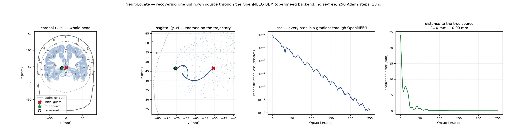

# NeuroLocate

**Differentiable EEG inference across PyTorch, OpenMEEG, and JAX**

**Tesseract Hackathon 2026 · Track 04 — Differentiable inference & UQ**

NeuroLocate is a sparse EEG source-localization workflow built from components
that normally live in separate numerical environments.

A PyTorch model proposes a small set of candidate source positions. OpenMEEG,
a native C++ boundary-element solver, evaluates those sources under a
bioelectromagnetic head model. JAX and Optax then refine the continuous source
parameters using gradients through the OpenMEEG calculation.

Tesseract provides the boundary between these systems. The neural component can
keep PyTorch and `torch.autograd`; the headfield component can keep OpenMEEG and
its hand-written derivative rule; the outer inference code remains JAX.


## Problem

EEG source localization is an inverse problem: given voltages measured at the
scalp, estimate the sources that produced them.

The source space used here contains roughly 20,000 possible cortical locations,
while the observation has 64 EEG channels. NeuroLocate therefore uses the same
sparse assumption as parametric dipole fitting: the number of active compact
sources, `K`, is assumed to be small.

`K` is supplied to every method in the benchmark.

For example, `K = 2` means estimating two source locations from the full source
space. It does not mean that only two candidate positions are considered.

The difficult cases in this project are sources with correlated or shared time
courses. Different spatial source configurations can then produce very similar
sensor measurements. A low sensor-space residual is therefore not sufficient,
by itself, to identify a unique anatomical answer.

NeuroLocate combines two different forms of information:

1. a learned proposal that gives the physical optimizer an informed
   initialization; and
2. continuous refinement against an explicit numerical forward model.

The contribution of this submission is the differentiable composition required
to combine them.

## Tesseract composition

The inference workflow spans three software stacks:

| part | implementation | role | derivative |
| --- | --- | --- | --- |
| `proposal` | PyTorch | EEG covariance → initial source set | `torch.autograd` on differentiable outputs |
| `headfield` | OpenMEEG / C++ | source parameters → scalp potentials | analytic moment VJP + finite-difference position VJP |
| outer loop | JAX / Optax | objective and continuous refinement | `jax.grad` |

The proposal and headfield are separate Tesseract components.

### `proposal`

The proposal component contains a trained 1.15 M-parameter PyTorch network. It
maps the EEG sensor covariance to a coarse spatial heatmap and continuous source
offsets.

Its output is used as an initialization for the physical inverse problem. It is
not an exhaustive search and it is not treated as the final source estimate.

Peak selection contains a hard `argmax` and greedy non-maximum suppression.
Those discrete choices are not differentiated. Continuous offsets and other
differentiable outputs retain their PyTorch derivative path.

### `headfield`

The headfield component wraps OpenMEEG 2.5.16 and evaluates arbitrary continuous
dipole positions using its symmetric boundary-element formulation.

OpenMEEG is compiled C++ software and does not expose an automatic-
differentiation graph. The Tesseract component therefore supplies the derivative
contract explicitly:

- dipole-moment derivatives use analytic linear algebra;
- source-position derivatives use central finite differences through the native
  OpenMEEG source assembly.

The numerical solver itself remains OpenMEEG. It is not reimplemented in JAX or
PyTorch.

### Outer inference

JAX defines the sensor-space objective and Optax performs the continuous
optimization.

During the headline inference experiment, gradients through the `headfield`
component update source position and moment for 300 steps. The learned proposal
changes the initialization; the physical objective, forward solver, optimizer,
and step count are otherwise unchanged.

The repository also contains a controlled through-solver fine-tuning experiment
in which the derivative continues through the differentiable proposal outputs
into PyTorch parameters. That verifies the longer cross-framework derivative
path, but under the tested protocol it did not improve localization. It is not
the source of the headline result.

### Gradient-based refinement through OpenMEEG



In a controlled `K = 1` example, JAX/Optax refines a continuous source position
through the OpenMEEG Tesseract from 24.0 mm initial error to effectively zero
over 250 optimizer steps. The reconstruction objective decreases throughout the
run, where every position update in JAX uses the VJP supplied by the OpenMEEG component.

This is a gradient-path demonstration, not the headline localization benchmark.
The harder `K = 2` evaluation below tests the learned initialization and physical
refinement under ambiguous multi-source conditions.

## Why Tesseract is useful here

There are other ways to connect these systems. The alternative, however, would
require project-specific interfaces for execution and derivative transport
between JAX, PyTorch, and a native C++ solver.

Tesseract gives the components a common contract while allowing each one to
retain the implementation appropriate to it:

- PyTorch remains responsible for the learned model and its autodiff;
- OpenMEEG remains responsible for the numerical head physics;
- the OpenMEEG wrapper defines its own VJP without introducing an AD framework
  into the solver;
- JAX treats the resulting component call as differentiable and can use it
  inside the inverse loop;
- the same component interfaces can be exercised in-process and as packaged
  container images.

The useful boundary in NeuroLocate is therefore not simply a container boundary.
It is a **derivative-strategy and framework boundary**: PyTorch automatic
differentiation and a manually defined derivative of a native C++ solver are
composed inside one inference program.

A directional finite-difference test is included for the composed derivative
path. The smallest recorded relative discrepancy in the configured test is
`2.51e-10`. This is a consistency check of the implemented derivative
composition, not a localization-performance metric.

## Evaluation

The public evaluation is synthetic and frozen.

It contains 10 conditions and 80 trials with matrix fingerprint:

```text
35b6e07a7e130731
````

The observations are deliberately not generated by the same forward calculation
used for inference. MNE-Python generates the observations using a different BEM
discretization; skull conductivity, electrode positions, and source positions
are also mismatched.

The purpose is to evaluate the inference workflow without evaluating it against
the exact numerical model that produced the data.

### Two-source benchmark

For the 40 `K = 2` trials, a source is counted as recovered when its
assignment-matched estimate lies within the benchmark's fixed 20 mm threshold.

| method                                          | source recovery |
| ----------------------------------------------- | --------------: |
| uninformed initialization + physical refinement |           41.3% |
| RAP-MUSIC                                       |           57.5% |
| four physical restarts                          |           71.3% |
| learned proposal                                |           80.0% |
| **learned proposal + physical refinement**      |       **82.5%** |

The decomposition matters.

The learned proposal accounts for most of the recovery difference:

```text
41.3%  uninformed initialization + refinement
80.0%  learned proposal
82.5%  learned proposal + refinement
```

Physical refinement has a clearer effect on continuous localization error. On
the 56 correlated and shared-dynamics trials, proposal + refinement has lower
paired median worst-source error than:

| comparison                             | paired median difference |
| -------------------------------------- | -----------------------: |
| proposal alone                         |                  −4.1 mm |
| uninformed initialization + refinement |                  −6.7 mm |
| RAP-MUSIC                              |                 −16.7 mm |

The corresponding intervals exclude zero in the frozen analysis.


### Comparison with repeated physical search

Four independent starts of the same physical refinement achieve comparable
paired localization error to proposal + refinement.

Their measured median inference times are approximately:

| method                 | median time / trial |
| ---------------------- | ------------------: |
| proposal + refinement  |              16.8 s |
| four physical restarts |              69.0 s |

These are inference-time measurements. They do not include the offline cost of
training the proposal network.

This result does not show that physical optimization is unable to reach useful
solutions. It shows that, in this benchmark, the learned proposal provides an
initialization that reduces the amount of repeated physical search required.

### One deterministic example

The repository includes one fixed `K = 2`, shared-dynamics example used by
`make demo`.

Its recorded results are:

| method                                 | worst-source error | sensor residual |
| -------------------------------------- | -----------------: | --------------: |
| uninformed initialization + refinement |           124.3 mm |          0.0117 |
| proposal alone                         |             8.7 mm |               — |
| proposal + refinement                  |             6.9 mm |          0.0120 |

The two refined solutions have almost identical sensor residuals despite very
different source errors. The example is therefore useful as an illustration of
the ambiguity of the inverse objective; it is not evidence that the learned
initialization has found a unique global optimum.

## Current scope

The current system is a demonstration of sparse differentiable inference, not a
general EEG source-imaging method.

In particular:

* `K` is supplied to every method;
* the main positive result is at `K = 2`;
* the learned proposal does not scale successfully to `K = 4` in the current
  benchmark;
* at `K = 4`, RAP-MUSIC is 29.9 mm better in paired median error;
* the benchmark uses synthetic EEG and template `fsaverage` anatomy;
* the proposal was trained once at one configuration;
* no clinical or medical-device performance claim is made.

The `K = 4` result is useful for locating the present limitation: the refinement
still improves the proposal, but the proposal itself no longer provides a
sufficiently good source set.

## Reproducibility

The repository includes the trained proposal checkpoint, frozen synthetic
observations, benchmark result shards, and packaged regression cases for both
Tesseract components.

A clean CPU demonstration is:

```bash
git clone https://github.com/BrainCapture/NeuroLocate
cd NeuroLocate

make setup
make demo
```

`make demo` requires no external dataset and no Docker runtime.

The broader validation paths are:

```bash
make test          # in-process tests
make summary       # regenerate benchmark summary from frozen shards
make figures       # regenerate the static benchmark figures

make build         # build the Tesseract component images
make test-images   # execute packaged cases against those images
```

The deterministic demo reports approximately:

```text
uninformed + refinement     124.3 mm
proposal only                 8.7 mm
proposal + refinement         6.9 mm
```

Each public result can be traced to a committed synthetic artifact. The mapping
between results, files, and reproduction commands is documented in
[`docs/REPRODUCIBILITY.md`](docs/REPRODUCIBILITY.md). The frozen benchmark
definition is documented in [`docs/BENCHMARK.md`](docs/BENCHMARK.md).

## Repository structure

```text
app/neurolayout/
    JAX objective, refinement, benchmark, and baselines

components/
    tesseracts/
        proposal/
            PyTorch model, checkpoint, component API, test cases

        headfield/
            OpenMEEG wrapper, VJPs, component API, test cases

    shared_code/
        numerical geometry and cached head-model utilities

scripts/
    demo, benchmark summary, and figure generation

results/hybrid/
    frozen synthetic observations and result shards

docs/
    BENCHMARK.md
    REPRODUCIBILITY.md
    figures/

tests/
    component, derivative, composition, and frozen-result checks
```

The internal Python packages retain the earlier `neurolayout` name.

## License

NeuroLocate project code is released under Apache-2.0.

OpenMEEG, MNE-Python, PyTorch, JAX, Optax, Tesseract, FreeSurfer-derived template
assets, and other third-party dependencies remain under their respective
licenses.
